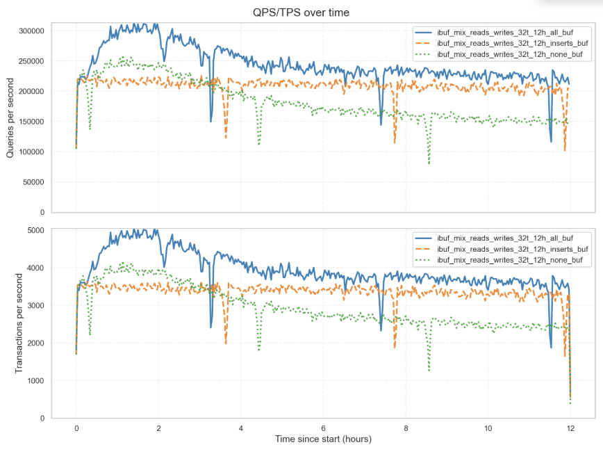
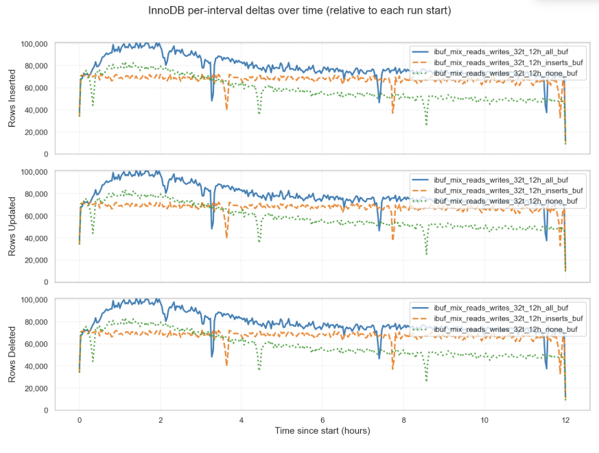
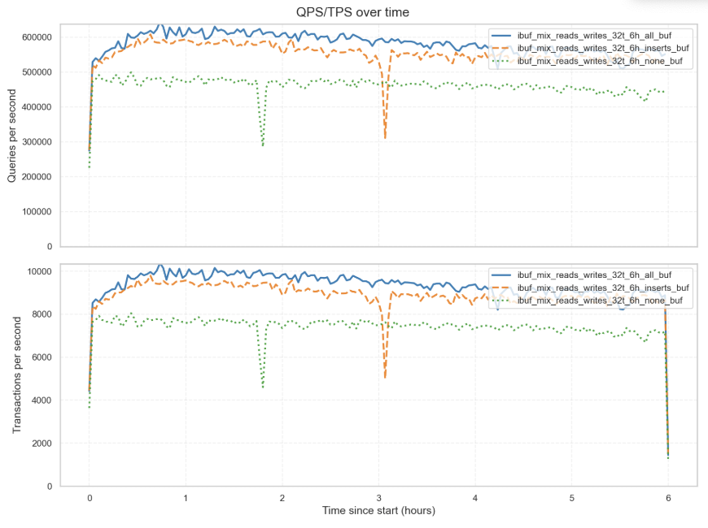
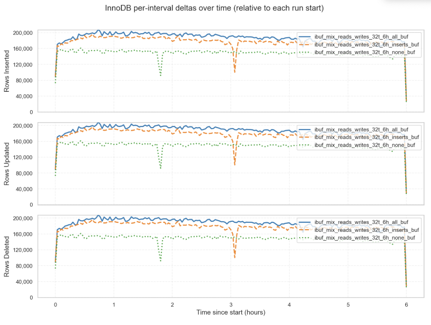
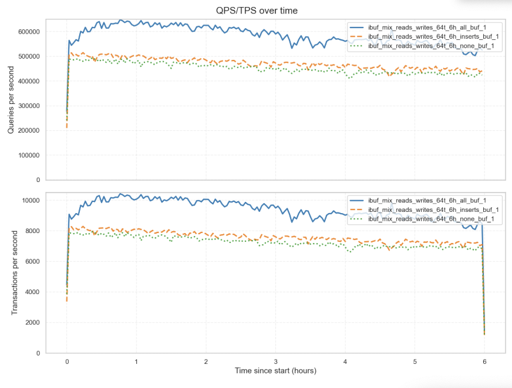
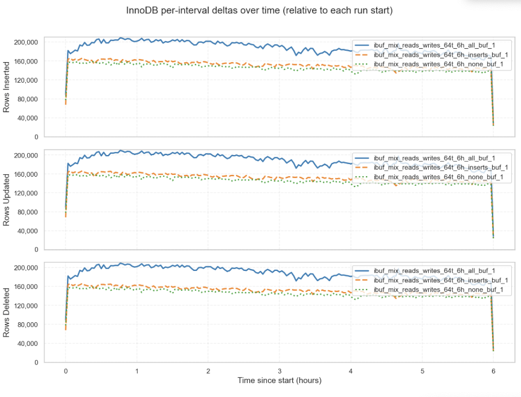
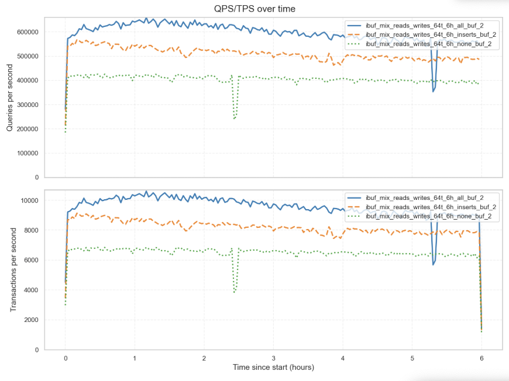
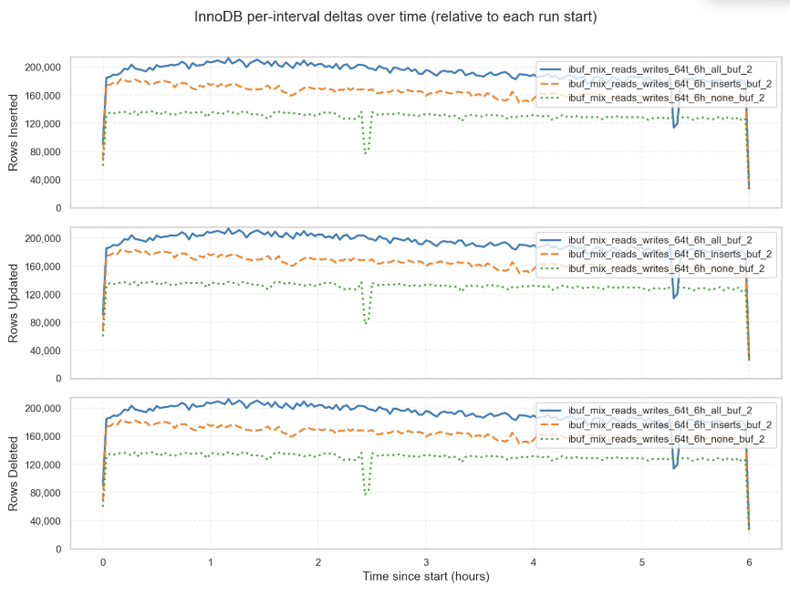
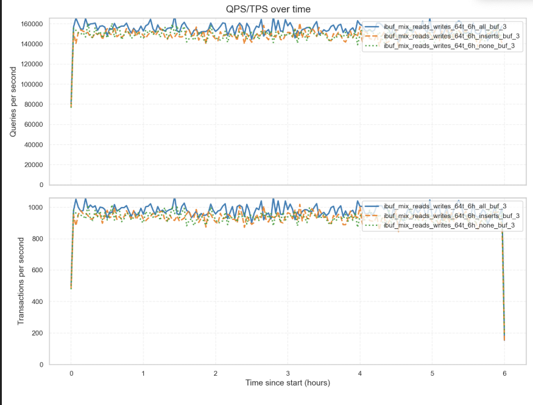
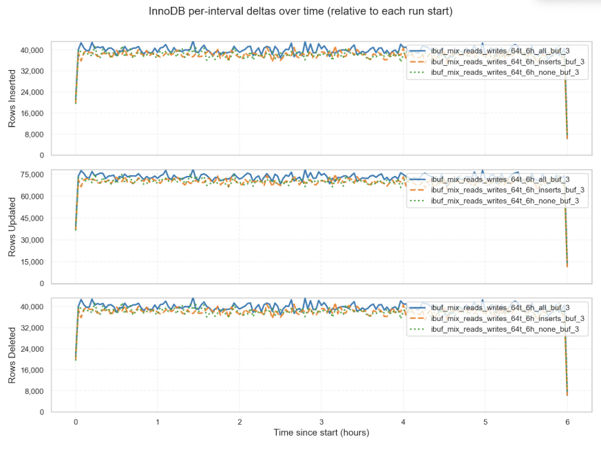

# Change Buffering Comparison – Report

This report evaluates the performance impact of the InnoDB change buffer under various workloads. It compares throughput with change buffering enabled for all vs inserts vs disabled, across different read/write mixes.

---

Benchmarking uses the script [sysbench_test.py](sysbench_test.py), which wraps Sysbench and automates prepare/run phases and logging. Because Slack’s tables are compressed with many secondary indexes, the sysbench oltp_common.lua script was modified to always use `ROW_FORMAT=COMPRESSED`. All benchmarks in this report were executed on Percona Server for MySQL 8.0.36-28.

## Test Preparation

Database preparation is performed using the `sysbench_test.py` script with the `--phase` option set to either `init` (for preparation only) or `both` (for preparation and run). 

For our tests, we prepared the database with 8 tables, each containing approximately 32 million rows, run:

```bash
python3 sysbench_test.py --phase init --tables 8 --table-size 32000000 --threads 8 --create-extra-indexes on
```

The table size was chosen to generate a dataset of about 50 GB, large enough to exceed the commonly configured 5 GB buffer pool through the tests that create I/O pressure for testing the change buffer’s performance impact.

This previous command creates the `sbtest` schema with 8 tables, each populated with 32M rows. The tables use `ROW_FORMAT=COMPRESSED` and include additional secondary indexes as the `--create-extra-indexes` option is enabled which adds the following secondary indexes as shown below:

```sql
mysql [localhost:34512] {msandbox} (sbtest) > show create table sbtest1\G
*************************** 1. row ***************************
       Table: sbtest1
Create Table: CREATE TABLE `sbtest1` (
  `id` int NOT NULL AUTO_INCREMENT,
  `k` int NOT NULL DEFAULT '0',
  `c` char(120) NOT NULL DEFAULT '',
  `pad` char(60) NOT NULL DEFAULT '',
  PRIMARY KEY (`id`),
  KEY `k_1` (`k`),
  KEY `idx_c` (`c`(20)),
  KEY `idx_pad` (`pad`(20)),
  KEY `idx_kid` (`k`,`id`)
) ENGINE=InnoDB AUTO_INCREMENT=32000001 DEFAULT CHARSET=utf8mb4 COLLATE=utf8mb4_0900_ai_ci ROW_FORMAT=COMPRESSED
1 row in set (0.00 sec)

mysql [localhost:34512] {msandbox} (sbtest) > SELECT table_name,
       ROUND(data_length/1024/1024/1024,2) AS data_gb,
       ROUND(index_length/1024/1024/1024,2) AS index_gb,
       ROUND((data_length+index_length)/1024/1024/1024,2) AS total_gb
FROM information_schema.tables
WHERE table_schema = 'sbtest';
+------------+---------+----------+----------+
| TABLE_NAME | data_gb | index_gb | total_gb |
+------------+---------+----------+----------+
| sbtest1    |    3.63 |     2.70 |     6.33 |
| sbtest2    |    3.63 |     2.69 |     6.32 |
| sbtest3    |    3.63 |     2.70 |     6.33 |
| sbtest4    |    3.63 |     2.70 |     6.32 |
| sbtest5    |    3.63 |     2.70 |     6.33 |
| sbtest6    |    3.63 |     2.70 |     6.32 |
| sbtest7    |    3.63 |     2.70 |     6.33 |
| sbtest8    |    3.63 |     2.70 |     6.33 |
+------------+---------+----------+----------+
8 rows in set (0.00 sec)
```

--- 

## Common MySQL Configuration

```
- `back_log = 250`
- `binlog_rows_query_log_events = ON`
- `innodb_max_dirty_pages_pct = 75`
- `innodb_lock_wait_timeout = 20`
- `innodb_stats_persistent_sample_pages = 500`
- `innodb_adaptive_hash_index = OFF`
- `innodb_max_dirty_pages_pct_lwm = 0`
- `event_scheduler = OFF`
- `slave_preserve_commit_order = ON`
- `replica_parallel_type = LOGICAL_CLOCK`
- `replica_parallel_workers = 8`
- `default_authentication_plugin = mysql_native_password`
- `innodb_thread_concurrency = 96`
- `range_optimizer_max_mem_size = 0`
- `binlog_expire_logs_seconds = 3600`
- `innodb_flush_log_at_trx_commit = 0`
- `sync_binlog = 0`
```

Server under usage highram3_b(10.30.8.237)

```
$ lscpu | egrep 'Model name|Socket|Core|Thread'
Model name:                         AMD EPYC 7452 32-Core Processor
Thread(s) per core:                 2
Core(s) per socket:                 32
Socket(s):                          2

$ free -h
               total        used        free      shared  buff/cache   available
Mem:           1.0Ti       159Gi       207Gi       865Mi       645Gi       847Gi
Swap:             0B          0B          0B

$ df -h /nvme
Filesystem      Size  Used Avail Use% Mounted on
/dev/md10       3.5T  2.0T  1.4T  59% /nvme
$ lsblk -d -o NAME,MODEL,SIZE,ROTA,MOUNTPOINT | awk 'NR==1 || /nvme|md10/'
NAME    MODEL                         SIZE ROTA MOUNTPOINT
nvme0n1 Dell Ent NVMe CM6 RI 3.84TB   3.5T    0
nvme1n1 Dell Ent NVMe CM6 RI 3.84TB   3.5T    0
```

---

## Test 1 – 32 Threads for 12 Hours

A 12-hour workload with 32 threads running a mix of inserts, deletes, and point/range selects was executed. The three buffering modes compared are:

- `innodb_change_buffering = all` in `*_all_buf`
- `innodb_change_buffering = inserts` in `*_inserts_buf`
- `innodb_change_buffering = none` in `*_none_buf`

### Configuration Values

- `innodb_buffer_pool_size = 512MB`
- `innodb_redo_log_capacity = 2GB`

### Benchmark executed commands

```
python3 sysbench_test.py --phase run --threads 32 --duration 43200 \
  --sysbench-script oltp_write_only \
  --sb-extra "--rand-type=uniform --index_updates=20 --delete_inserts=20 \
  --non_index_updates=0 --point_selects=10 --range_selects=on \
  --simple_ranges=1 --sum_ranges=1 --order_ranges=1 --distinct_ranges=1" \
  --test-name ibuf_mix_reads_writes_32t_12h_**_buf
```

### Results graphs





Graph created using:
```
python3 graph_comparison.py --folders \
  results_total/ibuf_mix_reads_writes_32t_12h_all_buf \
  results_total/ibuf_mix_reads_writes_32t_12h_inserts_buf \
  results_total/ibuf_mix_reads_writes_32t_12h_none_buf \
  --prefix results_total/test1 --bucket-seconds 120
```

### Interpretation

The results highlight the impact of change buffering on throughput and stability in 12‑hour runs with 32 threads. Throughput with `all` buffering mode was approximately 9% higher than `inserts` mode, and about 20% higher than `none` mode, indicating that enabling full change buffering improves performance noticeably at this concurrency level.

---

## Test 2 – 32 Threads for 6 Hours

This 6-hour test with 32 threads uses a similar workload and buffering modes as Test 1, enabling faster iteration while capturing relevant performance data. A higher buffer pool (5 GB) and smaller redo log (512 MB) were configured to highlight how buffer size and redo constraints affect throughput and stability under these workloads.

### Configuration Values

- `innodb_buffer_pool_size = 5GB`
- `innodb_redo_log_capacity = 512MB`
- `innodb_change_buffering = all` in `*_all_buf`, `inserts` in `*_inserts_buf`, `none` in `*_none_buf`
- Other settings follow [Common MySQL Configuration](#common-mysql-configuration).

### Sysbench Command

```
python3 sysbench_test.py --phase run --threads 32 --duration 21600 \
  --sysbench-script oltp_write_only \
  --sb-extra "--rand-type=uniform --index_updates=20 --delete_inserts=20 \
  --non_index_updates=0 --point_selects=10 --range_selects=on \
  --simple_ranges=1 --sum_ranges=1 --order_ranges=1 --distinct_ranges=1" \
  --test-name ibuf_mix_reads_writes_32t_6h_**_buf
```

### Results Graphs





Graph created using:
```
python3 graph_comparison.py --folders \
  results_total/ibuf_mix_reads_writes_32t_6h_all_buf \
  results_total/ibuf_mix_reads_writes_32t_6h_inserts_buf \
  results_total/ibuf_mix_reads_writes_32t_6h_none_buf \
  --prefix results_total/test2 --bucket-seconds 120
```

### Interpretation

With this different BP and redo differences, the results showed consistent confirming that even `inserts` mode provided clear gains over no buffering.

---

## Test 3 – 64 Threads for 6 Hours (Range Operations ×10)

This test increases concurrency to 64 threads and introduce range queries by 10×. The same buffering modes are compared.

### Configuration Values

- `innodb_buffer_pool_size = 5GB`
- `innodb_redo_log_capacity = 512MB`
- `innodb_change_buffering = all` in `*_all_buf_1`, `inserts` in `*_inserts_buf_1`, `none` in `*_none_buf_1`
- Other settings follow [Common MySQL Configuration](#common-mysql-configuration).

### Sysbench Command

```
python3 sysbench_test.py --phase run --threads 64 --duration 21600 \
  --sysbench-script oltp_read_write \
  --sb-extra "--rand-type=uniform --index_updates=20 --delete_inserts=20 \
  --non_index_updates=0 --point_selects=10 --range_selects=on \
  --simple_ranges=10 --sum_ranges=10 --order_ranges=10 --distinct_ranges=10" \
  --test-name ibuf_mix_reads_writes_64t_6h_**_buf
```

### Plotting Graphs





Graph created using:
```
python3 graph_comparison.py --folders \
  results_total/ibuf_mix_reads_writes_64t_6h_all_buf_1 \
  results_total/ibuf_mix_reads_writes_64t_6h_inserts_buf_1 \
  results_total/ibuf_mix_reads_writes_64t_6h_none_buf_1 \
  --prefix results_total/test3 --bucket-seconds 120
```

### Interpretation

With 64 threads and 10× range operations, full change buffering delivered the highest throughput. `all` mode stayed ~12% above `inserts` and ~18% above `none`, while `inserts` held lead over no buffering.

---

## Test 4 – 64 Threads for 6 Hours (Range Operations ×20)

Range operations are doubled to 20× with 64 threads and 6 hours duration. Point selects increase to 20. Buffering modes remain the same.

### Configuration Values

- `innodb_buffer_pool_size = 5GB`
- `innodb_redo_log_capacity = 512MB`
- `innodb_change_buffering = all` in `*_all_buf_2`, `inserts` in `*_inserts_buf_2`, `none` in `*_none_buf_2`
- Other settings follow [Common MySQL Configuration](#common-mysql-configuration).

### Sysbench Command

```
python3 sysbench_test.py --phase run --threads 64 --duration 21600 \
  --sysbench-script oltp_read_write \
  --sb-extra "--rand-type=uniform --index_updates=20 --delete_inserts=20 \
  --non_index_updates=0 --point_selects=20 --range_selects=on \
  --simple_ranges=20 --sum_ranges=20 --order_ranges=20 --distinct_ranges=20" \
  --test-name ibuf_mix_reads_writes_64t_6h_**_buf_2
```

### Results Graphs





Graph created using:
```
python3 graph_comparison.py --folders \
  results_total/ibuf_mix_reads_writes_64t_6h_all_buf_2 \
  results_total/ibuf_mix_reads_writes_64t_6h_inserts_buf_2 \
  results_total/ibuf_mix_reads_writes_64t_6h_none_buf_2 \
  --prefix results_total/test4 --bucket-seconds 120
```

### Interpretation

At 64 threads with 20× range ops, `all` mode sustained the best throughput, staying ~15% ahead of `inserts` and ~22% ahead of `none`. 

---

## Test 5 – 64 Threads for 6 Hours (Heavier Writes)

This test doubles index updates and delete/inserts, adds non-index updates, with 64 threads over 6 hours. Buffering modes are consistent.

### Configuration Values

- `innodb_buffer_pool_size = 5GB`
- `innodb_redo_log_capacity = 512MB`
- `innodb_change_buffering = all` in `*_all_buf_3`, `inserts` in `*_inserts_buf_3`, `none` in `*_none_buf_3`
- Other settings follow [Common MySQL Configuration](#common-mysql-configuration).

### Sysbench Command

```
python3 sysbench_test.py --phase run --threads 64 --duration 21600 \
  --sysbench-script oltp_read_write \
  --sb-extra "--rand-type=uniform --index_updates=40 --delete_inserts=40 \
  --non_index_updates=20 --point_selects=20 --range_selects=on \
  --simple_ranges=20 --sum_ranges=20 --order_ranges=20 --distinct_ranges=20" \
  --test-name ibuf_mix_reads_writes_64t_6h_**_buf_3
```

### Results Graphs



Graph created using:
```
python3 graph_comparison.py --folders \
  results_total/ibuf_mix_reads_writes_64t_6h_all_buf_3 \
  results_total/ibuf_mix_reads_writes_64t_6h_inserts_buf_3 \
  results_total/ibuf_mix_reads_writes_64t_6h_none_buf_3 \
  --prefix results_total/test5 --bucket-seconds 120
```

```
$ grep "queries:" *_3 -r
ibuf_mix_reads_writes_64t_6h_all_buf_3/sysbench_run_20250907_223802.log:    queries:                             55248867 (2557.38 per sec.)
ibuf_mix_reads_writes_64t_6h_inserts_buf_3/sysbench_run_20250908_132450.log:    queries:                             53368632 (2470.37 per sec.)
ibuf_mix_reads_writes_64t_6h_none_buf_3/sysbench_run_20250908_043921.log:    queries:                             53388783 (2471.33 per sec.)
```

### Interpretation

The gap was smaller than in earlier tests, but `all` buffering mode still provided measurable benefits compared to no buffering at this concurrency level.

---
