# Comprehensive Change Buffer Benchmark Report

This document unifies the findings from two change-buffer benchmarking initiatives:

- **Phase A (Tests 1–5):** 6/12-hours Sysbench suites on compressed tables with 32 M rows per table. These tests explored how change buffering behaves under varying read/write mixes, range operations, and update intensities.
- **Phase B (16×16M matrix runs):** Two-hour batches on a dedicated Percona Server 8.0.36 sandbox using 16-table/16 M-row workloads across compressed and uncompressed layouts, iterating the four `innodb_change_buffering` modes (`all`, `inserts`, `none`, `deletes`).

Both phases were benchmarked using the shared test case [`sysbench_test.py`](./sysbench_test.py), which orchestrates the prepare and run phases in a controlled manner.  

Because the issue that prompted this benchmarking effort arose on compressed tables with extensive secondary indexing, we evaluated configurations across both compressed and uncompressed row formats, testing with varying secondary index setups.

## Index

1. [Environment Overview](#1-environment-overview)
2. [Common MySQL Configuration](#2-common-mysql-configuration)
3. [Table Layouts & Datasets](#3-table-layouts--datasets)
   - [3.1 Phase A datasets](#31-phase-a-datasets-tests-15)
   - [3.2 Phase B datasets](#32-phase-b-datasets-16×16m-matrix-runs)
4. [Results Phase A — 6h/12h Campaign](#phase-a-results)
   - [4.1 Test 1 — 32 Threads, 12 Hours](#phase-a-test-1)
   - [4.2 Test 2 — 32 Threads, 6 Hours](#phase-a-test-2)
   - [4.3 Test 3 — 64 Threads, 6 Hours](#phase-a-test-3)
   - [4.4 Test 4 — 64 Threads, 6 Hours](#phase-a-test-4)
   - [4.5 Test 5 — 64 Threads, 6 Hours](#phase-a-test-5)
   - [4.6 Phase A takeaway](#phase-a-takeaway)
5. [Results Phase B — 16×16M Matrix Runs](#phase-b-results)
   - [5.1 `c_full` results](#phase-b-c-full)
   - [5.2 `cx_full` results](#phase-b-cx-full)
   - [5.3 `x_full` results](#phase-b-x-full)
   - [5.4 Phase B takeaway - Conclusions](#phase-b-takeaway)

## 1. Environment Overview

| Attribute | Phase A (Tests 1–5) | Phase B (16×16M matrix runs) |
|-----------|--------------------|-------------------------|
| MySQL build | Percona Server for MySQL 8.0.36-28 | Percona Server for MySQL 8.0.36-28 |
| Host | Percona Server 8.0.36 sandbox | Percona Server 8.0.36 sandbox |
| Buffer pool | 5 GiB (Tests 2–5); 512 MiB for Test 1 | 8 GiB |
| Redo capacity | 512 MiB (Tests 2–5); 2 GiB for Test 1 | 8 GiB |
| Dataset size | ≈50 GiB working set (8×32 M rows compressed) | 38–86 GiB (16×16 M rows, compressed vs uncompressed variants) |
| Threads | 32 or 64 depending on test | 32 |
| Duration | 6–12 hours per run | 7 200 s (2 hours) per run |

Both phases also used a common MySQL configuration baseline:

## 2. Common MySQL Configuration

```
- `back_log = 250`
- `binlog_rows_query_log_events = ON`
- `innodb_max_dirty_pages_pct = 75`
- `innodb_lock_wait_timeout = 20`
- `innodb_stats_persistent_sample_pages = 500`
- `innodb_adaptive_hash_index = OFF`
- `innodb_max_dirty_pages_pct_lwm = 0`
- `event_scheduler = OFF`
- `slave_preserve_commit_order = ON`
- `replica_parallel_type = LOGICAL_CLOCK`
- `replica_parallel_workers = 8`
- `default_authentication_plugin = mysql_native_password`
- `innodb_thread_concurrency = 96`
- `range_optimizer_max_mem_size = 0`
- `binlog_expire_logs_seconds = 3600`
- `innodb_flush_log_at_trx_commit = 0`
- `sync_binlog = 0`
```


Server under usage for benchmarking:

```
$ lscpu | egrep 'Model name|Socket|Core|Thread'
Model name:                         AMD EPYC 7452 32-Core Processor
Thread(s) per core:                 2
Core(s) per socket:                 32
Socket(s):                          2

$ free -h
               total        used        free      shared  buff/cache   available
Mem:           1.0Ti       159Gi       207Gi       865Mi       645Gi       847Gi
Swap:             0B          0B          0B

$ df -h /nvme
Filesystem      Size  Used Avail Use% Mounted on
/dev/md10       3.5T  2.0T  1.4T  59% /nvme
$ lsblk -d -o NAME,MODEL,SIZE,ROTA,MOUNTPOINT | awk 'NR==1 || /nvme|md10/'
NAME    MODEL                         SIZE ROTA MOUNTPOINT
nvme0n1 Dell Ent NVMe CM6 RI 3.84TB   3.5T    0
nvme1n1 Dell Ent NVMe CM6 RI 3.84TB   3.5T    0
```

## 3. Table Layouts & Datasets

### 3.1 Phase A datasets (Tests 1–5)
- 8 tables per database, 32 million rows per table.
- `ROW_FORMAT=COMPRESSED KEY_BLOCK_SIZE=8`.
- Indexes: primary key on `id`, secondary key on `k`, and additional secondary indexes added to stress change buffer.
- Database size ≈50 GiB (data and indexes).

```sql
-- table definition excerpt
mysql [localhost:34512] {msandbox} (sbtest) > show create table sbtest1\G
*************************** 1. row ***************************
       Table: sbtest1
Create Table: CREATE TABLE `sbtest1` (
  `id` int NOT NULL AUTO_INCREMENT,
  `k` int NOT NULL DEFAULT '0',
  `c` char(120) NOT NULL DEFAULT '',
  `pad` char(60) NOT NULL DEFAULT '',
  PRIMARY KEY (`id`),
  KEY `k_1` (`k`),
  KEY `idx_c` (`c`(20)),
  KEY `idx_pad` (`pad`(20)),
  KEY `idx_kid` (`k`,`id`)
) ENGINE=InnoDB AUTO_INCREMENT=32000001 DEFAULT CHARSET=utf8mb4 COLLATE=utf8mb4_0900_ai_ci ROW_FORMAT=COMPRESSED
1 row in set (0.00 sec)

mysql [localhost:34512] {msandbox} (sbtest) > SELECT table_name,
       ROUND(data_length/1024/1024/1024,2) AS data_gb,
       ROUND(index_length/1024/1024/1024,2) AS index_gb,
       ROUND((data_length+index_length)/1024/1024/1024,2) AS total_gb
FROM information_schema.tables
WHERE table_schema = 'sbtest';
+------------+---------+----------+----------+
| TABLE_NAME | data_gb | index_gb | total_gb |
+------------+---------+----------+----------+
| sbtest1    |    3.63 |     2.70 |     6.33 |
| sbtest2    |    3.63 |     2.69 |     6.32 |
| sbtest3    |    3.63 |     2.70 |     6.33 |
| sbtest4    |    3.63 |     2.70 |     6.32 |
| sbtest5    |    3.63 |     2.70 |     6.33 |
| sbtest6    |    3.63 |     2.70 |     6.32 |
| sbtest7    |    3.63 |     2.70 |     6.33 |
| sbtest8    |    3.63 |     2.70 |     6.33 |
+------------+---------+----------+----------+
8 rows in set (0.00 sec)
```

### 3.2 Phase B datasets (16×16M matrix runs)

| Scenario | Row format & indexes | Tables × rows | Approximate size |
|----------|---------------------|---------------|-------------------|
| `c_full` | Compressed (`ROW_FORMAT`=`COMPRESSED`); PK + `KEY k_1(k)` | 16 × 16 M | 38 GiB |
| `cx_full` | Compressed with additional secondary indexes on `c`, `pad`, `(k,id)` | 16 × 16 M | 50 GiB |
| `x_full` | Uncompressed with same secondary indexes as `cx_full` | 16 × 16 M | 86 GiB |

<a id="phase-a-results"></a>
## 4. Results Phase A — Legacy 6h/12h Campaign (Tests 1–5)

These suites evaluated change-buffer settings across a range of read/write mixes. Each subsection lists the command template, configuration highlights, graphs, and key observations.

<a id="phase-a-test-1"></a>
### 4.1 Test 1 — 32 Threads, 12 Hours (Baseline Mix)
- Dataset: 8 tables × 32 M rows (`ROW_FORMAT=COMPRESSED` + extra secondary indexes).
- MySQL settings: `innodb_buffer_pool_size=512MiB`, `innodb_redo_log_capacity=2GiB`.
- Change buffer modes exercised: `all`, `inserts`, `none`.

```
python3 sysbench_test.py --phase run --threads 32 --duration 43200 \
  --sysbench-script oltp_write_only \
  --sb-extra "--rand-type=uniform --index_updates=20 --delete_inserts=20 \
  --non_index_updates=0 --point_selects=10 --range_selects=on \
  --simple_ranges=1 --sum_ranges=1 --order_ranges=1 --distinct_ranges=1" \
  --test-name ibuf_mix_reads_writes_32t_12h_**_buf
```

### Results Graphs

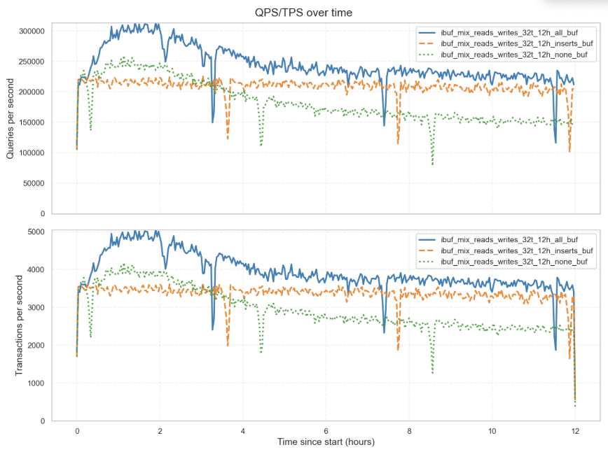
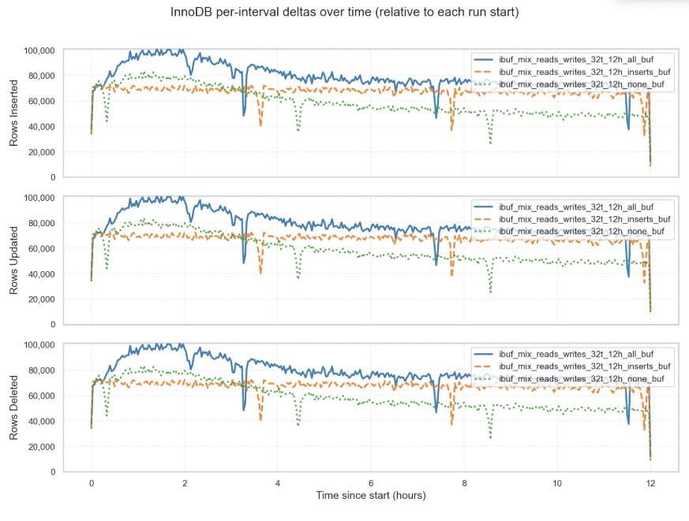

Key findings:
- The results highlight the impact of change buffering on throughput and stability in 12‑hour runs with 32 threads. Throughput with `all` buffering mode was approximately ≈12% higher than `inserts` mode, and about ≈30% higher than `none` mode, indicating that enabling full change buffering improves performance at this concurrency level.

<a id="phase-a-test-2"></a>
### 4.2 Test 2 — 32 Threads, 6 Hours (Heavier range reads)
- Variants: range operations scaled up, buffer pool increased to 5 GiB.

```
python3 sysbench_test.py --phase run --threads 32 --duration 21600 \
  --sysbench-script oltp_write_only \
  --sb-extra "--rand-type=uniform --index_updates=20 --delete_inserts=20 \
  --non_index_updates=0 --point_selects=10 --range_selects=on \
  --simple_ranges=1 --sum_ranges=1 --order_ranges=1 --distinct_ranges=1" \
  --test-name ibuf_mix_reads_writes_32t_6h_**_buf
```

This 6-hour test with 32 threads uses a similar workload and buffering modes as Test 1, enabling faster iteration while capturing relevant performance data. A higher buffer pool (5 GB) and smaller redo log (512 MB) were configured to highlight how buffer size and redo constraints affect throughput and stability under these workloads.

### Results Graphs

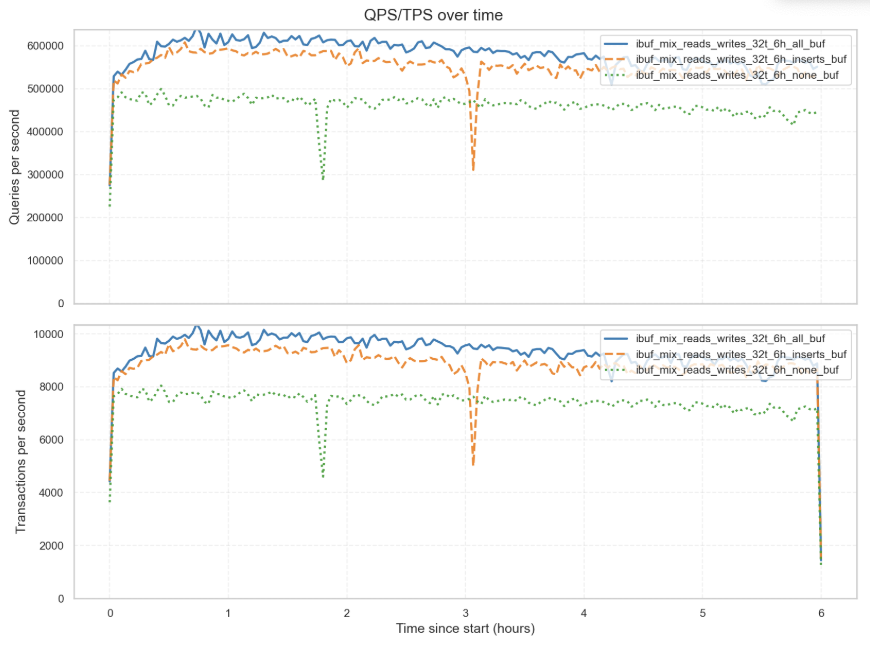
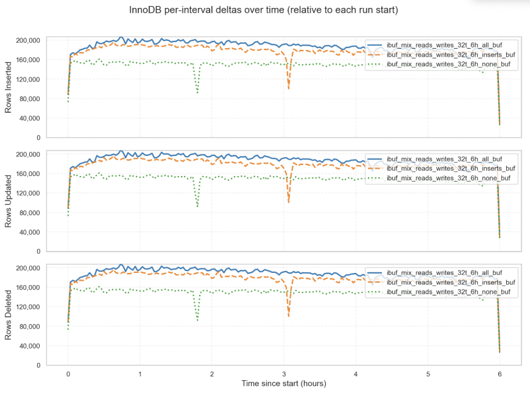

- The change buffer (`all`) retained a throughput edge, though the gap narrowed (≈8–10 %).

<a id="phase-a-test-3"></a>
### 4.3 Test 3 — 64 Threads, 6 Hours (Range Selects ×10)

This test increases concurrency to 64 threads and introduce range queries by 10×. The same buffering modes are compared.

- Command excerpt:
```
python3 sysbench_test.py --phase run --threads 64 --duration 21600 \
  --sysbench-script oltp_read_write \
  --sb-extra "--rand-type=uniform --index_updates=20 --delete_inserts=20 \
  --non_index_updates=0 --point_selects=10 --range_selects=on \
  --simple_ranges=10 --sum_ranges=10 --order_ranges=10 --distinct_ranges=10" \
  --test-name ibuf_mix_reads_writes_64t_6h_**_buf
```

### Results Graphs

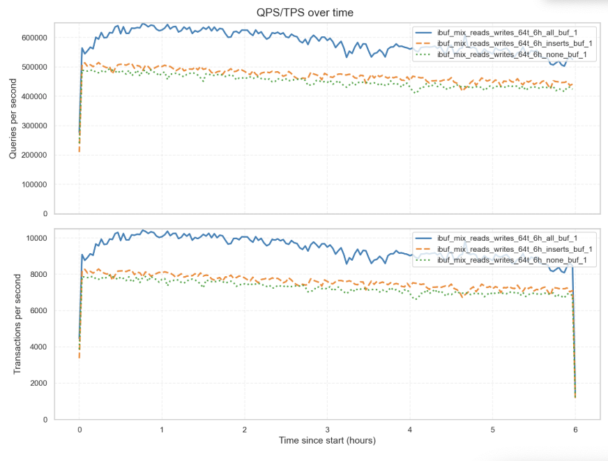
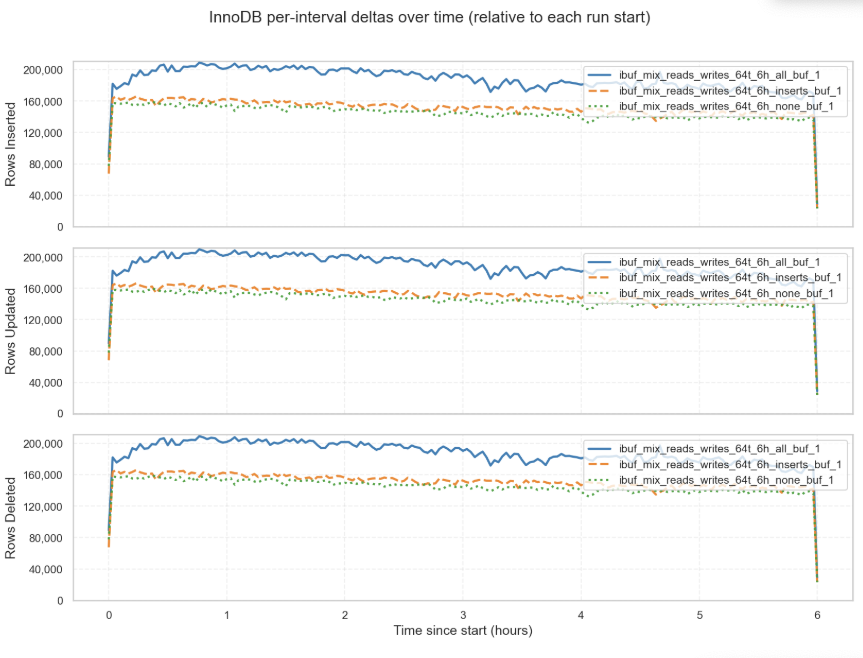

Observations:
- With 64 threads and 10× range operations, full change buffering delivered the highest throughput. `all` mode stayed ~12% above `inserts` and ~18% above `none`, while `inserts` held lead over no buffering.

<a id="phase-a-test-4"></a>
### 4.4 Test 4 — 64 Threads, 6 Hours (Range Selects ×20)
- Range operations are doubled to 20× with 64 threads and 6 hours duration. Point selects increase to 20. Buffering modes remain the same.

```
python3 sysbench_test.py --phase run --threads 64 --duration 21600 \
  --sysbench-script oltp_read_write \
  --sb-extra "--rand-type=uniform --index_updates=20 --delete_inserts=20 \
  --non_index_updates=0 --point_selects=20 --range_selects=on \
  --simple_ranges=20 --sum_ranges=20 --order_ranges=20 --distinct_ranges=20" \
  --test-name ibuf_mix_reads_writes_64t_6h_**_buf_2
```

### Results Graphs

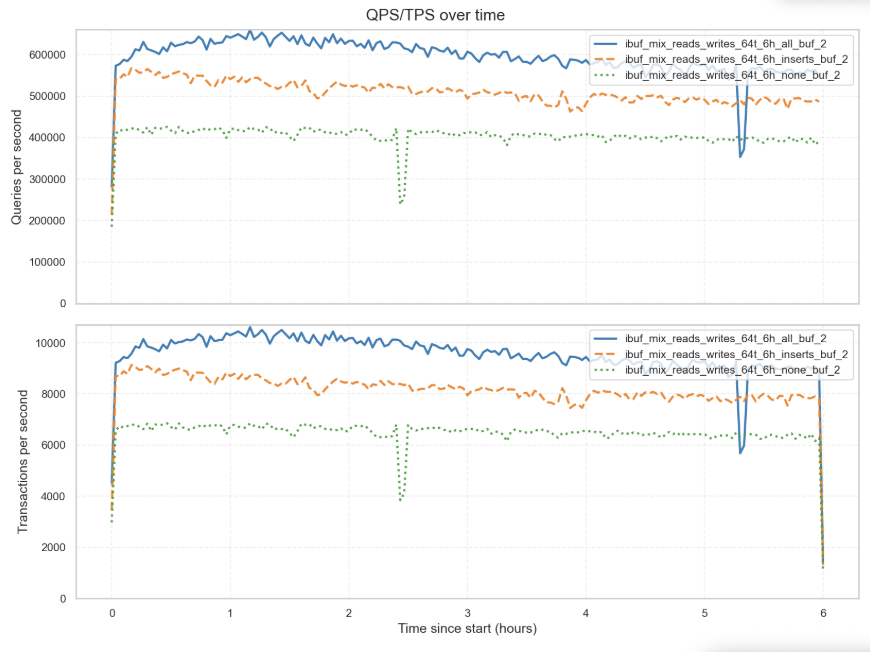
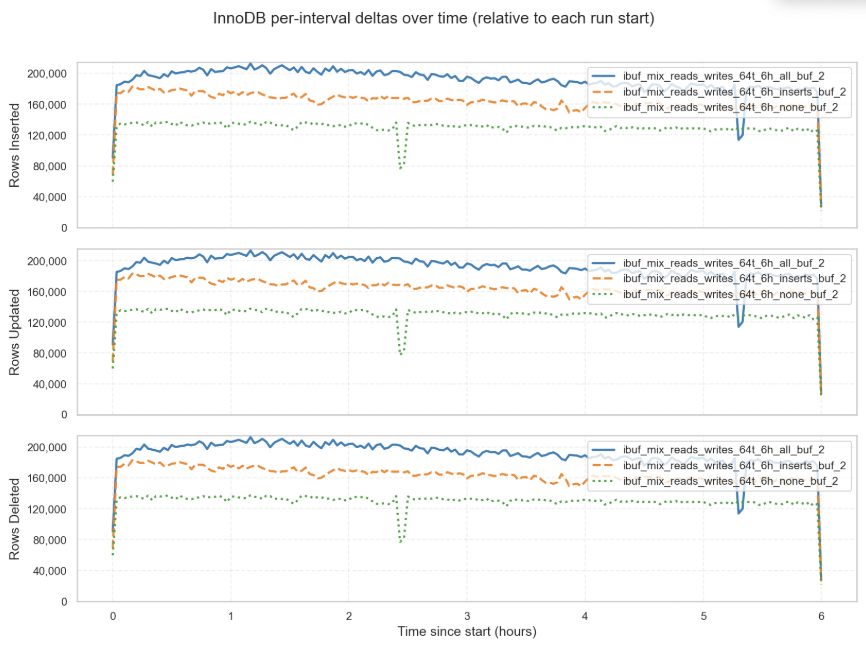

Observations:
- At 64 threads with 20× range ops, `all` mode sustained the best throughput, staying ~15% ahead of `inserts` and ~22% ahead of `none`. 

<a id="phase-a-test-5"></a>
### 4.5 Test 5 — 64 Threads, 6 Hours (Heavier Updates)

This test doubles index updates and delete/inserts, adds non-index updates, with 64 threads over 6 hours. Buffering modes are consistent.

```
python3 sysbench_test.py --phase run --threads 64 --duration 21600 \
  --sysbench-script oltp_read_write \
  --sb-extra "--rand-type=uniform --index_updates=40 --delete_inserts=40 \
  --non_index_updates=20 --point_selects=20 --range_selects=on \
  --simple_ranges=20 --sum_ranges=20 --order_ranges=20 --distinct_ranges=20" \
  --test-name ibuf_mix_reads_writes_64t_6h_**_buf_3
```

### Results Graphs

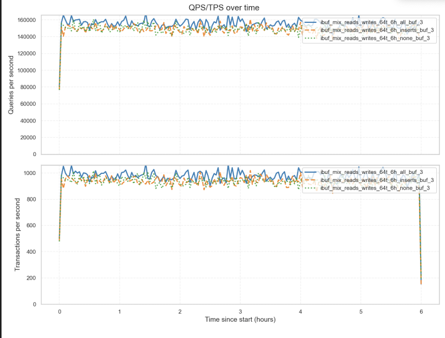
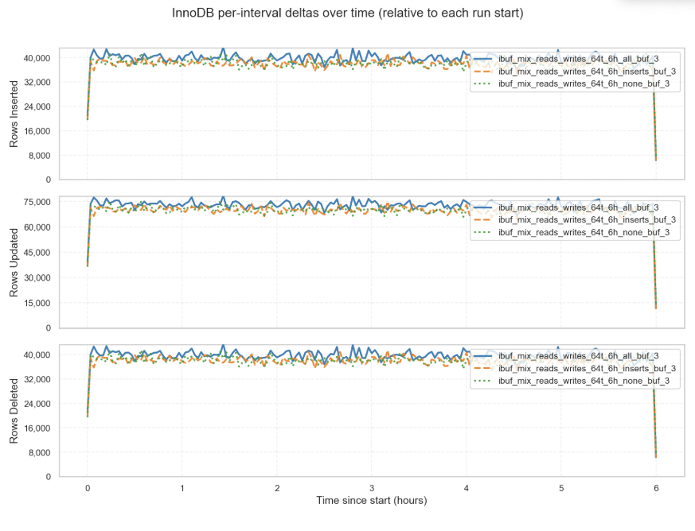


```
$ grep "queries:" *_3 -r
ibuf_mix_reads_writes_64t_6h_all_buf_3/sysbench_run_20250907_223802.log:    queries:                             55248867 (2557.38 per sec.)
ibuf_mix_reads_writes_64t_6h_inserts_buf_3/sysbench_run_20250908_132450.log:    queries:                             53368632 (2470.37 per sec.)
ibuf_mix_reads_writes_64t_6h_none_buf_3/sysbench_run_20250908_043921.log:    queries:                             53388783 (2471.33 per sec.)
```

### Interpretation

The gap was smaller than in earlier tests, but `all` buffering mode still provided measurable benefits compared to no buffering at this concurrency level.

<a id="phase-a-takeaway"></a>
### 4.6 Phase A takeaway
On compressed tables with multiple secondary indexes, broad change buffering (`all`) consistently helped at high concurrency, while disabling buffering hit throughput. Because Phase A only exercised that single layout, Phase B tests compressed tables with and without the extra secondary indexes separately and adds an uncompressed layout for contrast.

<a id="phase-b-results"></a>
## 5. Results Phase B — 16×16M Matrix Runs (2‑Hour Workloads)

Phase B updates the workload: each layout stages 16 tables with 16 M rows (≈38–86 GiB on disk) and runs for the full two-hour window while we toggle `innodb_change_buffering`. The layouts in this case differ only in table definition:

- `c_full`: compressed rows with the standard sysbench schema (PK on `id`, secondary index on `k`).
- `cx_full`: same row format but adds secondary indexes on `c`, `pad`, and `(k,id)` to stress change buffer.
- `x_full`: identical indexes to `cx_full`, but the tables use the default uncompressed row format (`ROW_FORMAT=DYNAMIC`).

Throughput QPS/TPS and the sustained change-buffer activity (insert/delete-mark merges per second) are summarised below

| Layout | Change buffer | TPS (avg) | QPS (est.) | Insert merges/s | Delete-mark merges/s | Delete merges/s |
|--------|----------------|-----------|------------|-----------------|-----------------------|-----------------|
| c_full | inserts | 31,184 | 187,101 | 0.00 | 0.00 | 0.00 |
| c_full | all | 31,282 | 187,691 | 0.14 | 0.19 | 0.01 |
| c_full | none | 31,291 | 187,749 | 0.00 | 0.00 | 0.00 |
| c_full | deletes | 31,495 | 188,972 | 0.00 | 0.08 | 0.00 |
| cx_full | inserts | 11,067 | 66,403 | 7,600.43 | 0.00 | 0.00 |
| cx_full | all | 10,920 | 65,517 | 23,757.50 | 23,665.00 | 3,060.48 |
| cx_full | none | 7,522 | 45,131 | 0.89 | 0.00 | 0.00 |
| cx_full | deletes | 6,956 | 41,737 | 0.00 | 424.44 | 0.38 |
| x_full | inserts | 8,635 | 51,809 | 12,341.32 | 0.00 | 0.00 |
| x_full | all | 12,217 | 73,302 | 29,618.37 | 29,485.71 | 4,553.04 |
| x_full | none | 6,396 | 38,374 | 3.17 | 0.00 | 0.00 |
| x_full | deletes | 6,005 | 36,031 | 0.00 | 947.61 | 2.00 |

<a id="phase-b-c-full"></a>
### 5.1 `c_full` — Compressed, Minimal Secondary Indexes

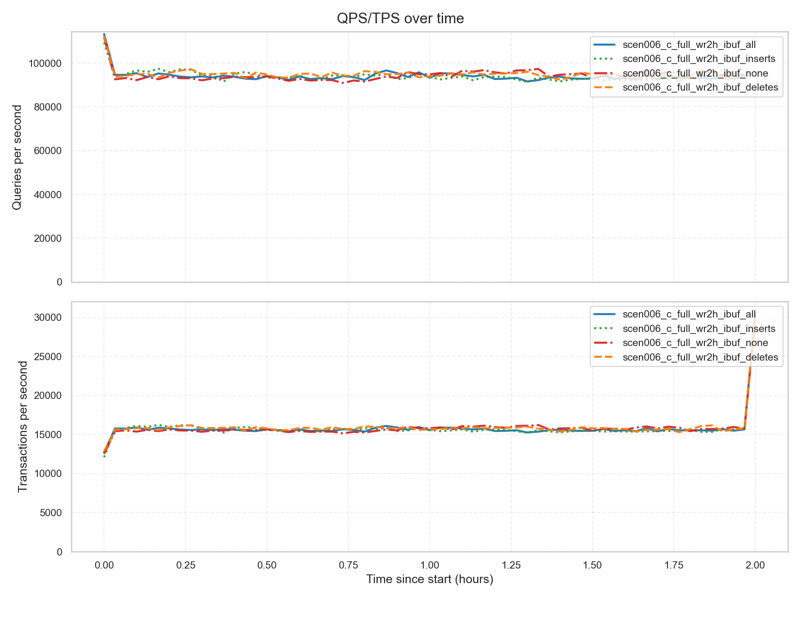
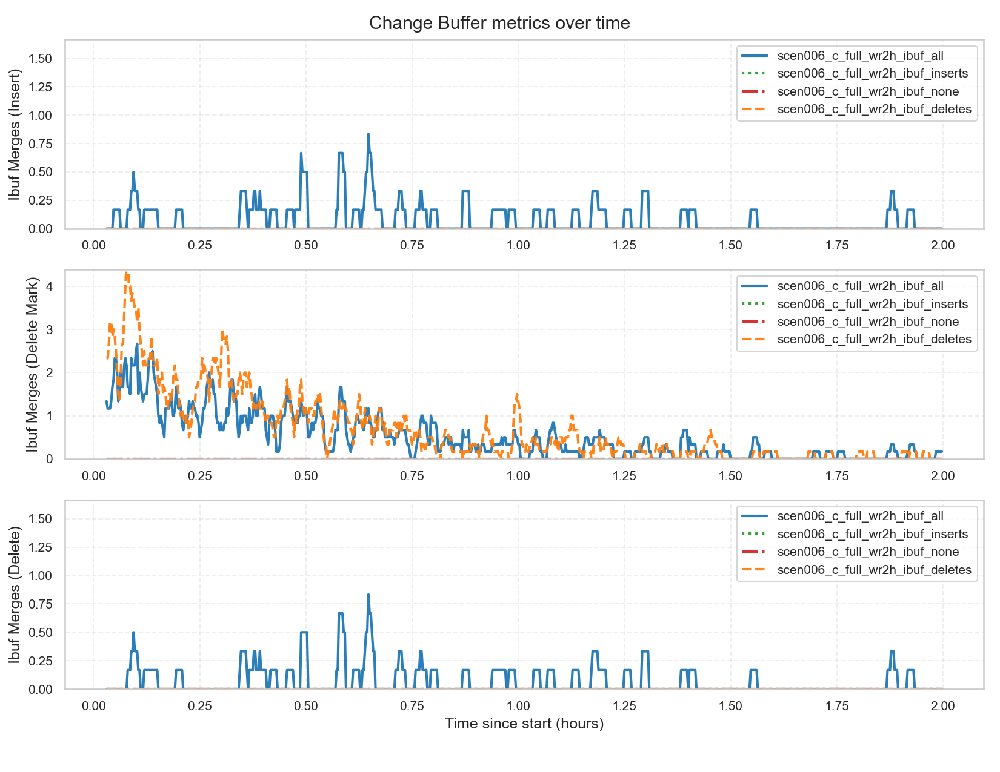

- Throughput and latency remain stable across all modes; the `deletes` run finished ~1% ahead.
- Change buffer activity is negligible: `all` averaged 0.14 insert merges/s while the other modes remained at zero (or near-zero for `deletes`).
- Default to `innodb_change_buffering=inserts` or even `none` here—the access pattern keeps the working set hot enough that buffering adds little value.

<a id="phase-b-cx-full"></a>
### 5.2 `cx_full` — Compressed, Extra Secondary Indexes

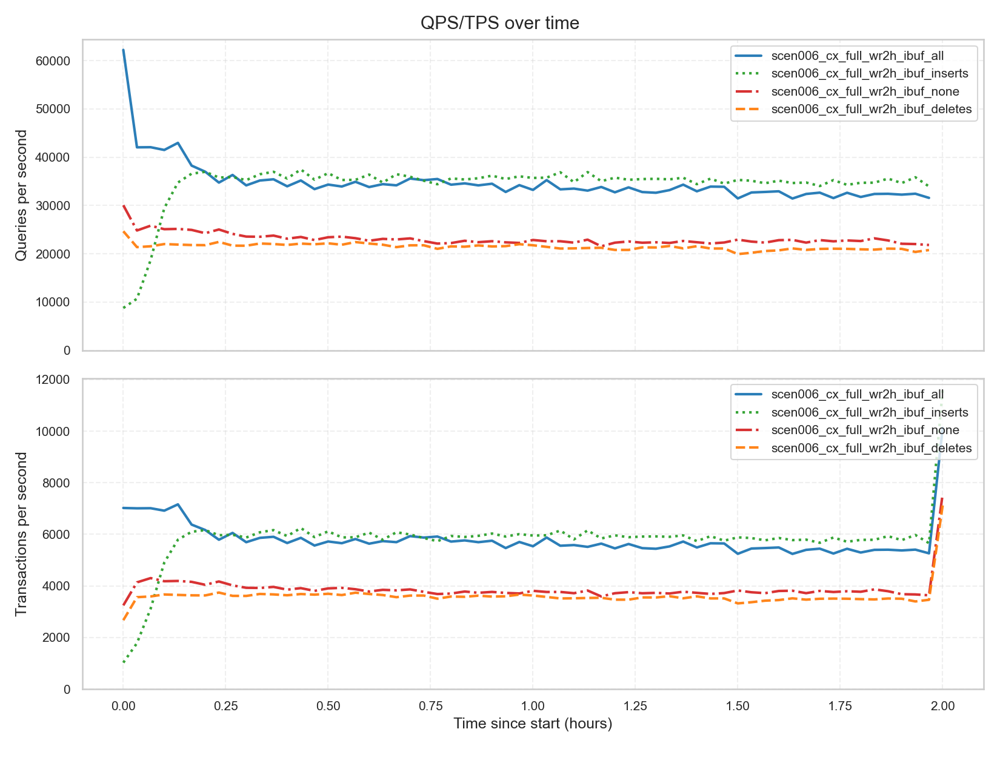
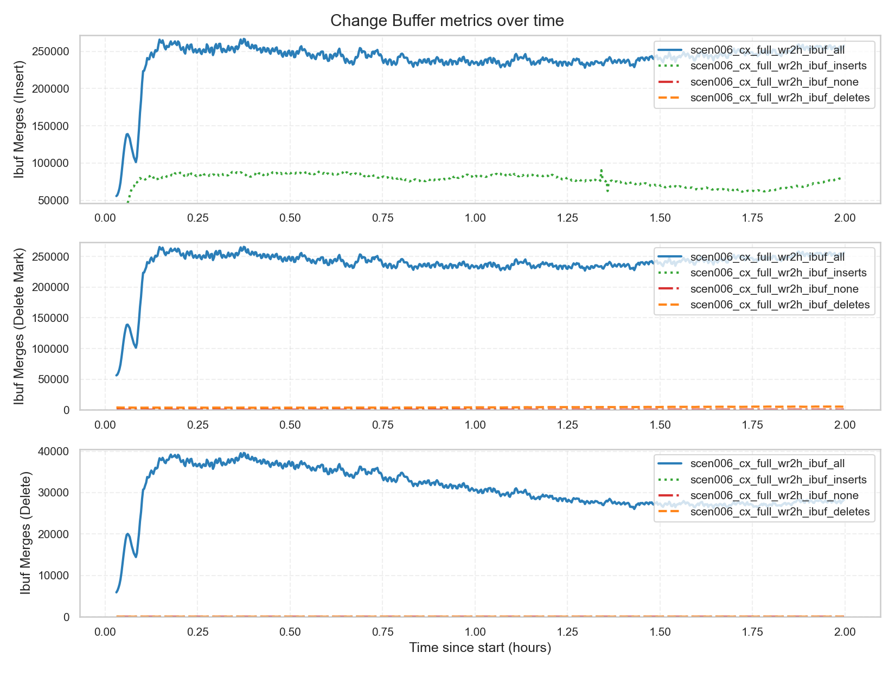

- `inserts` delivered the best throughput (~36.1 k QPS) while keeping change-buffer merges to ~7.6 k inserts/s and zero delete-mark work.
- `all` finished ~1.3 % lower than `inserts` and accumulated ~23.8 k insert merges/s plus ~23.7 k delete-mark merges/s—extra work without upside.
- Disabling buffering (or targeting deletes) drops throughput 32–37 %, as every secondary index change happens synchronously.

<a id="phase-b-x-full"></a>
### 5.3 `x_full` — Uncompressed Row Format, Extra Secondary Indexes

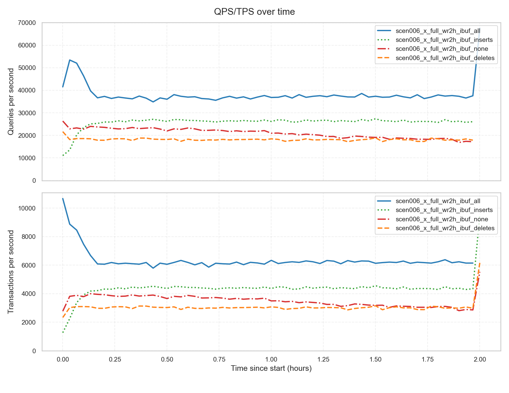
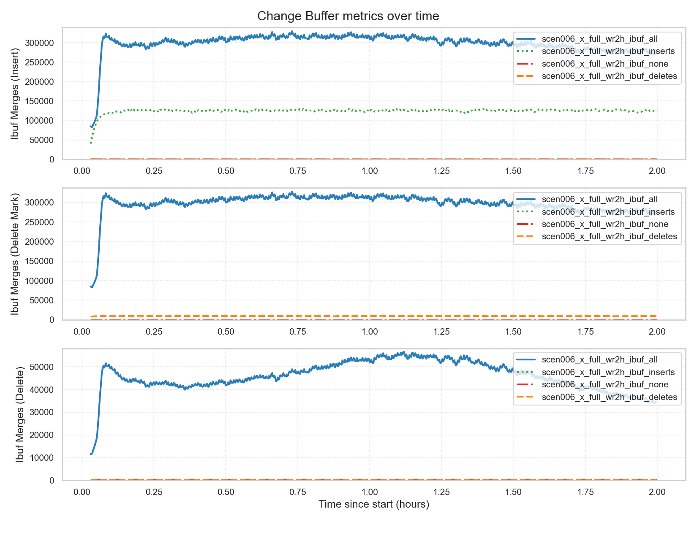

- `all` leads on throughput (~39.2 k QPS) but churns ~29.6 k insert merges/s plus ~29.5 k delete-mark merges.
- `inserts` dials that merge rate back to ~12.3 k inserts/s (zero delete-marks) while holding ~28.6 k QPS, which is often one practical sweet spot.
- These tests show that even on uncompressed tables, throughput suffers when extra secondary indexes are present.

<a id="phase-b-takeaway"></a>
### 5.4 Phase B takeaway - Conclusions
Across these layouts, `inserts` stands out as the safest and most balanced recommended setting. It keeps merge rates under control, sustains near‑top throughput, and runs through simpler, well‑tested code paths that have shown fewer issues in practice. Turning buffering off (`none`/`deletes`) forces all secondary index changes to run synchronously, cutting throughput by 25–35 %. Going broad with `all` can yield headline QPS, but at the cost of massive merge debt (tens of thousands of merges/s) that still needs to be processed later. In conclusion, `inserts` provides the most predictable and robust performance, combining steady throughput with proven stability across code paths.
